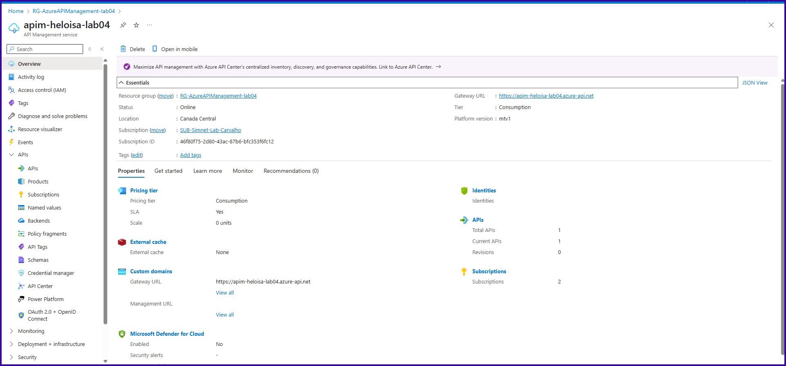
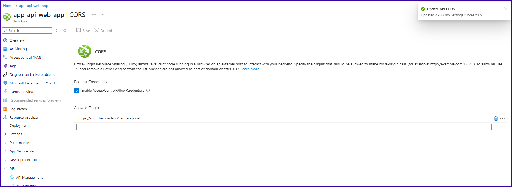

# Azure API Management - Weather Forecast API (Python + FastAPI)

This lab demonstrates the deployment of a secure Python FastAPI app using Azure App Service (Linux), protected by Azure API Management, and secured with JWT validation.

## 🧩 Architecture

- **Client** → Postman / External App
- **API Management** → Gateway with rate-limiting, JWT validation, and backend routing
- **App Service (Linux)** → Hosts the FastAPI `/weatherforecast` endpoint
- **Azure Entra ID** → Issues and validates JWT tokens

## 🌐 Public Endpoint

- **APIM URL**: `https://apim-heloisa-lab04.azure-api.net/pagamento/v1`
- **Backend URL**: `https://app-api-web-app-eccdgycvd8aqfffd.canadacentral-01.azurewebsites.net/weatherforecast`

## 📦 Deployment Summary

| Resource Type     | Name                                | Notes                            |
|------------------|-------------------------------------|----------------------------------|
| Resource Group    | RG-AzureAPIManagement-lab04         |                                  |
| API Management    | apim-heloisa-lab04                  | Secures the FastAPI              |
| App Service       | app-api-web-app                     | Hosts FastAPI on Linux           |
| Subscription Key  | Enabled via `x-api-key`             | Required                         |
| JWT Token         | Validated via inbound policy        | Optional header: `Authorization` |
| Named Value       | jwt-secret                          | Used in custom JWT               |

## 🔐 JWT Policy (APIM)

```xml
<validate-jwt header-name="Authorization"
              failed-validation-httpcode="401"
              failed-validation-error-message="Token Nao tem permissao"
              require-expiration-time="true"
              require-scheme="Bearer">
  <issuer-signing-keys>
    <key>https://sts.windows.net/<TENANT_ID>/</key>
  </issuer-signing-keys>
  <audiences>
    <audience>api://<CLIENT_ID></audience>
  </audiences>
</validate-jwt>
```

## 🚀 FastAPI Sample Output

```json
[
  {"date": "2025-05-20", "temperatureC": 12, "summary": "Cool"},
  {"date": "2025-05-21", "temperatureC": 8, "summary": "Mild"}
]
```

## 🧪 Postman Setup

- Add `x-api-key` header with your APIM key.
- If enabled, include JWT in `Authorization: Bearer <token>`.

## 📸 Screenshots

### Codigo de API


### Web app


### API



### Recursos


### API acessivel


### Configuracao CORS


### Configuracao Inboud


### App Gateway e Permissao


### Postman


